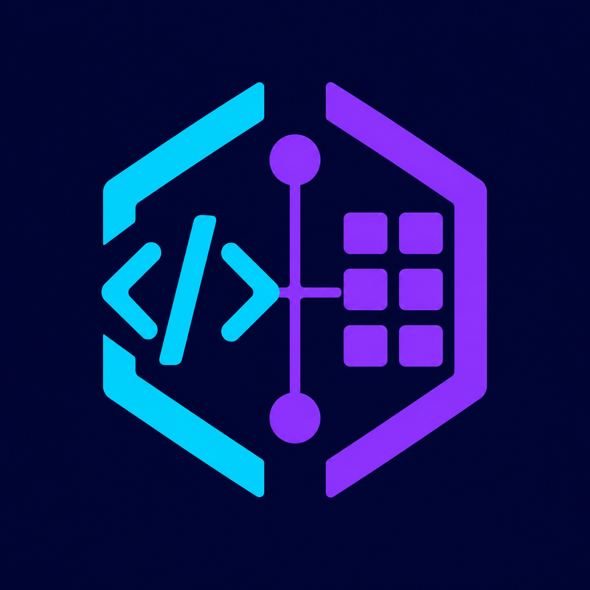

# OpenEdge ABL Toolkit — Comunidade

  

Este é o portal público oficial da comunidade do **OpenEdge ABL Toolkit** para
suporte, relatos de problemas, sugestões e pedidos de funcionalidades.

## Como participar

### Encontrei um problema

Antes de publicar, consulte as
[issues existentes](https://github.com/Psykhepathos/OpenEdge-ABL-Toolkit-Community/issues)
para verificar se o problema já foi relatado.

Se não houver uma issue equivalente,
[abra um relato de bug](https://github.com/Psykhepathos/OpenEdge-ABL-Toolkit-Community/issues/new?template=bug_report.yml).
Informe a versão da extensão, a versão do OpenEdge, o comportamento esperado, o
comportamento observado e os passos necessários para reproduzir o problema.
Inclua imagens ou trechos de logs apenas depois de remover dados sensíveis.

### Quero sugerir uma funcionalidade

[Abra um feature request](https://github.com/Psykhepathos/OpenEdge-ABL-Toolkit-Community/issues/new?template=feature_request.yml)
e descreva:

- o problema ou necessidade que motivou a sugestão;
- o resultado esperado;
- como a funcionalidade ajudaria seu fluxo de trabalho;
- um exemplo de uso, quando possível.

### Tenho uma dúvida

Para perguntas gerais, ideias ainda em discussão ou troca de experiências, use
as [Discussions](https://github.com/Psykhepathos/OpenEdge-ABL-Toolkit-Community/discussions).

## Privacidade

Este repositório não contém o código-fonte, pacotes VSIX, instaladores,
configurações de bancos ou artefatos internos do produto.

Não publique:

- endereços IP, hostnames internos, portas ou topologia de rede;
- usuários, senhas, tokens, chaves ou arquivos de configuração;
- código-fonte proprietário;
- schemas, nomes sensíveis de bancos, tabelas ou campos;
- logs completos sem anonimização;
- vulnerabilidades de segurança.

Para relatar uma vulnerabilidade, não abra uma issue pública: siga as
orientações de [SECURITY.md](SECURITY.md). O acesso ao produto e aos
instaladores é concedido separadamente pelo mantenedor a usuários autorizados.

## Sobre o projeto

OpenEdge e Progress são marcas de seus respectivos proprietários. Este projeto
é independente e não é afiliado, patrocinado ou endossado pela Progress
Software Corporation.
